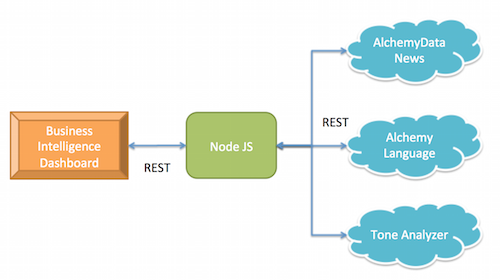

# Business Intelligence: Business Intelligence

This application is an **Application Starter Kit** (ASK) that is designed to get you up and running quickly with a common industry pattern, and to provide information about best practices around Watson services. The **Business Intelligence** application was created to highlight the combination of the [AlchemyData News][alchemydata-news], [Alchemy Language][alchemy-language], and [Tone Analyzer][tone-analyzer] services as a [Business Intelligence](#about-the-business-intelligence-pattern) tool. This application can serve as the basis for your own applications that follow that pattern.

Give it a try! Click the button below to fork the repository that contains the source code for this application into IBM DevOps Services, which then deploys your own copy of this application on Bluemix automatically:

[](https://bluemix.net/deploy?repository=https://github.com/watson-developer-cloud/business-intelligence-application-starter-kit)

**IMPORTANT:**
This application requires an AlchemyAPI key with high transaction limits. The free AlchemyAPI key that you request has a limit of 1000 transactions per day, which is insufficient for significant use of this sample application. See [step 3](#step3) of the [Getting Started](#getting-started) section for information about requesting a higher transaction limit on your sample AlchemyAPI key.

## Table of Contents
  - [How this app works](#how-this-app-works)
  - [Getting Started](#getting-started)
  - [Running the application locally](#running-the-application-locally)
  - [About the Business Intelligence pattern](#about-the-business-intelligence-pattern)
    - [When to use this pattern](#when-to-use-this-pattern)
    - [Best practices](#best-practices)
  - [Reference information](#reference-information)
    - [AlchemyData News and AlchemyLanguage](#alchemyapi)
    - [Tone Analyzer](#tone-analyzer)
  - [User interface in this sample application](#user-interface-in-this-sample-application)
  - [Troubleshooting](#troubleshooting)

## How this app works

This application provides a web interface to search for information about a company and its publicly perception. The query interface uses the semantic information available from AlchemyAPI to limit search results to company-related information.

AlchemyData News provides extensive access to news sources, which are then analyzed by the Tone Analyzer service to show how the company is perceived. In addition, the overall customer sentiment about the company is displayed, as well as sentiment information about the top 10 related concepts.

## Getting started
The application is written in [Node.js](http://nodejs.org/) and uses [npm](https://www.npmjs.com/).  Instructions for downloading and installing these are included in the following procedure.

**Important:** If you used the `Deploy to Bluemix` button to deploy an instance of this application to Bluemix automatically, you will have to delete that application and the services that it used before you can build and deploy an application manually. You can use the `cf apps` command to see the instances of running applications, use the `cf delete application-name` command to delete the application, and use the `cf delete-services service--name` command to delete each of applications.

The following instructions explain how to fork the project on GitHub and push that fork to Bluemix using the `cf` command-line interface (CLI) for Cloud Foundry. If you want to run the application locally, see the next section, [Running the application locally](#running-the-application-locally):

  1. Log into GitHub and fork the project repository. Clone your fork to a folder on your local system and change to that folder.

  2. Create a Bluemix account. [Sign up][sign_up] in Bluemix or use an existing account. Watson services in beta are free to use, as are GA services in the standard plan below a certain usage threshold.

  <a name="step3"></a>
  3.  Get an [Alchemy API key][get-alchemyapi-key]. The page that displays after you create a key, provides a form that enables you to request a higher transaction limit than the default for free keys, which is 1000 transactions per day.

  4. If it is not already installed on your system, download and install the [Cloud-foundry CLI][cloud_foundry] tool.

  5. If it is not already installed on your system, install [Node.js](http://nodejs.org/). Installing Node.js will also install the `npm` command.

  6. Open app.js file, and specify the API key here:

     `var alchemyApiKey = { api_key: process.env.ALCHEMY_API_KEY || '<your api key>'};`

  7. Edit the `manifest.yml` file in the folder that contains your fork and replace `business-intelligence` with a unique name for your copy of the application. The name that you specify determines the application's URL, such as `application-name.mybluemix.net`.

    ```yml
declared-services:
  tone-analyzer-service:
    label: tone_analyzer
    plan: beta
applications:
- name: business-intelligence
  command: npm start
  path: .
  memory: 512M
  services:
  - tone-analyzer-service
  env:
    NODE_ENV: production
    SECURE_EXPRESS: 1
    ```
  6. Connect to Bluemix by running the following commands in a terminal window:

    ```sh
    $ cf api https://api.ng.bluemix.net
    $ cf login -u <your-Bluemix-ID> -p <your-Bluemix-password>
    ```

  7. Create an instance of the Tone Analyzer service in Bluemix by running the following command:

    ```sh
    $ cf create-service tone_analyzer beta tone-analyzer-service
    ```
    **Note:** The Tone Analyzer service is currently a beta service.

  11. Push the updated application live by running the following command:

    ```sh
    $ cf push
    ```

## Running the application locally

Follow the steps in the [previous section](#getting-started) and ensure that you are still logged in to Bluemix.

  1. Install any dependencies that a local version of your application requires:

    ```sh
    $ npm install
    ```
  2. Make note of the `username`, `password`, and `url` credentials from your `tone-analyzer-service` service in Bluemix. To see the service credentials for your Tone Analyzer service instance, run the following command, replacing `<application-name>` with the name of the application that you specified in your `manifest.yml` file:
    ```sh
    $ cf env <application-name>
    ```
  The output should contain a section similar to the following:
    ```sh
    System-Provided:
    {
    "VCAP_SERVICES": {
      "tone_analyzer": [{
        "credentials": {
          "url": "<url>",
          "password": "<password>",
          "username": "<username>"
        },
        "label": "tone_analyzer",
        "name": "tone-analyzer-service",
        "plan": "beta"
     }]
    }
    }
    ```

  3. Create a `.env.js` file in the root directory of the project with the following content, filling in the credentials with the information from the previous step:

      ```js
      'use strict';

      module.exports = {
        VCAP_SERVICES: JSON.stringify({
          tone_analyzer: [{
            credentials: {
              url: 'https://gateway.watsonplatform.net/tone-analyzer-beta/api',
              username: 'TONE ANALYZER USERNAME HERE',
              password: 'TONE ANALYZER PASSWORD HERE'
            }
          }],

        VCAP_APP_PORT: 3000
      })};
      ```


  4. Start the application by running:

    ```sh
    $ node app.js
    ```

  5. Open [http://localhost:6001](http://localhost:6001) to see the running application.

## About the Business Intelligence pattern

This sample application demonstrates how to use natural language processing to understand popular sentiment about a topic using AlchemyData News, AlchemyLanguage and Tone Analyzer APIs.

The sample application is made up of two major components:
* NodeJS server - This application acts as a proxy between the web-based dashboard and the Alchemy services
* Web-based dashboard client - This dashboard helps you understand how the public feels about a company.



The Node JS application exposes the following endpoints for the dashboard:
* /api/sentiments - this endpoint is used to determine the overall sentiment for a company
* /api/keywords - this endpoint is used to determine the top concepts related to the company
* /api/sources - this endpoint is used to determine the top news sources for the company
* /api/articles - this endpoint is used to retrieve a list of articles from one of the top sources
* /api/tone - this endpoint is used to send the content of an article (specified by an url) to the Alchemy Tone Analyzer

When one of these endpoints is called, based on the query parameters provided, the server tranlates the request into appropriate queries for the Alchemy services.  When the server receives a response, it relays the responses back to the web-based dashboard.

The application makes use of the AlchemyData News API to get the overall sentiment, top keywords, news sources, and a list of articles related to the company. This API allows us to query for news articles from a diverse list of data sources from the last 60 days.  In this application, the queries are designed to search for articles related to the *company* entity type.  

If you are interested in articles related to other entity types, e.g. technology, product, you can modify the application to search for a different entity type.  Modify the *entityQuery* function in `app.js`:

```js
function entityQuery(entity) {
  return '\|text=' + entity + ',type=company,relevance=>0.25\|';
}
```

For a full list of supported entity types, refer to documentation [here](http://www.alchemyapi.com/api/entity/types).

To get the tone of one of the articles found, the server uses the Alchemy Language and the Tone Analyzer API: from the AlchemyData News API, the server retrieves the URL of an article related to the company; The server then sends this URL to the Alchemy Language Text Extract API to get the text content of the article; finally, it passes the article content to the Tone Anayzer API.

### When to use this pattern

* You want to analyze news articles from a vast number of news sources.
* You want to understand how certain entities are perceived by the public from these news data sources.

### Best practices

* **Use the relevance parameter** - When searching for articles related to an entity or keyword from the AlchemyData News API, use the *relevance* parameter to improve the accuracy of the search.  If this parameter is not specified, any article that mentions the provided entity or keyword will be returned.  Thus, in some cases, the article may actually be not very relevant.  Use this parameter to help find articles that are truly relevant to what you are looking for.
*  **Be specific about what AlchemyData News should return** - When constructing a query for the AlchemyData News API, you can specify the *return* parameter to control what the query should return.  For example, you may ask the service to simply return a list of *keywords*, which include all keywords found.  For each keyword, all attributes associated with the keyword object will also be returned.  This can result in a large amount of data to be transferred between the AlchemyData News service and the Node JS server, and can result in performance problem in your application.  To improve performance, only specify the minimum set of attributes required by your application to reduce the data transfer cost.

## Reference information
The following links provide more information about the AlchemyData News, Alchemy Language, and Tone Analyzer services, including tutorials on using those services:

### AlchemyAPI
* [API documentation](http://www.alchemyapi.com/api): Get an in-depth understanding of the AlchemyAPI services
* [AlchemyData News reference](http://docs.alchemyapi.com/): API and query gallery

### Tone Analyzer
* [API documentation](http://www.ibm.com/smarterplanet/us/en/ibmwatson/developercloud/doc/tone-analyzer/): Get an in-depth understanding of the Tone Analyzer service
* [API reference](http://www.ibm.com/smarterplanet/us/en/ibmwatson/developercloud/tone-analyzer/api/v1/): SDK code examples and reference
* [API explorer](http://www.ibm.com/smarterplanet/us/en/ibmwatson/developercloud/apis/tone-analyzer-apis.html): Try out the REST API

## User interface in this sample application

The user interface that this sample application provides is intended as an example; it is not proposed as the user interface for your application. However, if you want to use this user interface, modify the following files:

* `public/index.html` - Defines the items that are displayed in the footer for the sample application. By default, the items in the footer are placeholders for IBM-specific values because they are used in the running instance of this sample application. For example, the Terms and Conditions do not apply to your use of the source code, to which the [Apache license](#license) applies.
* `public/artifacts/main.css` - Defines the graphics that are used at various places in the sample application

## Troubleshooting
When troubleshooting your Bluemix app, the most useful source of information is the execution logs. To see them, run:

  ```sh
  $ cf logs <application-name> --recent
  ```

## Open Source @ IBM
  Find more open source projects on the [IBM GitHub Page](http://ibm.github.io/)

### License
  This sample code is licensed under the Apache 2.0 license. Full license text is available in [LICENSE](LICENSE).

## Contributing
  See [CONTRIBUTING](CONTRIBUTING.md).


[cloud_foundry]: https://github.com/cloudfoundry/cli
[sign_up]: https://console.ng.bluemix.net/registration/
[get-alchemyapi-key]: https://console.ng.bluemix.net/catalog/services/alchemyapi/
[get-alchemyapi-key]: http://www.alchemyapi.com/api/register.html
[tone-analyzer]: http://www.ibm.com/smarterplanet/us/en/ibmwatson/developercloud/tone-analyzer.html
[alchemydata-news]: http://www.ibm.com/smarterplanet/us/en/ibmwatson/developercloud/alchemy-data-news.html
[alchemy-language]: http://www.ibm.com/smarterplanet/us/en/ibmwatson/developercloud/alchemy-language.html
